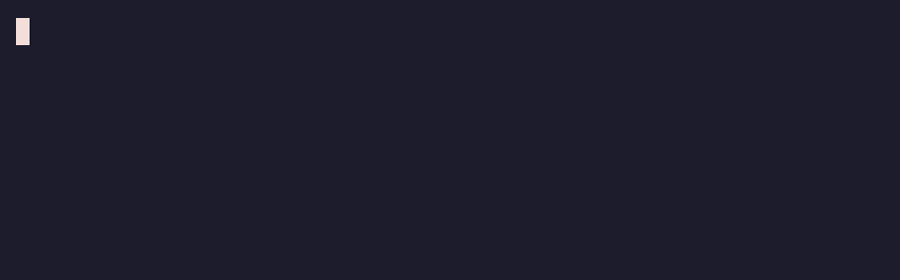

# Ezmoji

System-wide `:shortcode:` emoji autocomplete for macOS. Type `:` and a few letters in any app,
a picker appears at your cursor, and Tab (or Enter) inserts the emoji.



*Terminal re-enactment (`vhs docs/demo.tape`); the real picker is a native popup at your caret.*

## Install

### Homebrew

```sh
brew install --cask lukebward/tap/ezmoji
```

The app isn't notarized, so if Gatekeeper blocks the first launch:

```sh
xattr -d com.apple.quarantine /Applications/Ezmoji.app
```

### From source

```sh
./build.sh
cp -r build/Ezmoji.app /Applications/
open /Applications/Ezmoji.app
```

Requires the Xcode command line tools (`swiftc`); no other dependencies.

## First-run permission

Ezmoji watches keystrokes globally, which macOS gates behind Accessibility. Enable it under
System Settings → Privacy & Security → Accessibility (a prompt appears on first launch). The
app picks up the grant within a couple of seconds; no relaunch needed. If typing still doesn't
insert, also check Input Monitoring.

The menu bar icon shows permission status and has Pause, Launch at Login, and Quit.

## Usage

- `:smi` — picker appears after the first letter and filters as you type
- Tab or Enter — insert the highlighted emoji
- ↑ / ↓ — move the highlight
- Esc — dismiss
- `:tada:` typed in full inserts immediately, no Tab needed
- Space or any other non-shortcode character cancels

Shortcodes are the [gemoji](https://github.com/github/gemoji) set used by GitHub and Discord,
and mostly by Slack: `:joy:`, `:+1:`, `:fire:`, `:eyes:`, `:rocket:`, `:thinking_face:` —
about 1,900 aliases, bundled in `Resources/emoji.json`.

## Per-app exclusions

Ezmoji stays inactive in apps that already have `:emoji:` autocomplete:

- Chat: Slack, Discord (+ PTB/Canary), Telegram (both variants), WhatsApp, Signal, Microsoft
  Teams (new + classic), Element, Mattermost, Rocket.Chat, Zulip, Beeper
- Productivity: Notion, Figma, Linear, ClickUp, Asana, GitHub Desktop, Claude (Claude Code has
  its own completion)

Zoom is not excluded — its emoji shortcodes have no keyboard autocomplete. Neither are editors
like VS Code, Cursor, Zed, or Obsidian.

Manage the list from the menu bar: "Disable in ‹App›" toggles the app you were just using, and
"App Exclusions" lists known apps with a checkmark on the excluded ones — click to toggle either
way. The list persists in `defaults` (domain `dev.lukeward.Ezmoji`, keys `excludedApps` and
`knownApps`).

Exclusions are per-app, not per-site: to avoid overlapping with GitHub's in-browser
autocomplete you would have to exclude the whole browser.

## Limitations

- `:` only arms the picker after a word boundary, so `std::vector` and `https://` don't
  trigger it.
- macOS Secure Input blocks event taps, so Ezmoji is inert in password fields.
- `build.sh` signs with an Apple Development certificate when available, so the Accessibility
  grant survives rebuilds. The ad-hoc fallback requires re-granting after each rebuild.
- Insertion deletes the typed `:query` with synthetic backspaces, then types the emoji as a
  unicode keystroke. Works in native apps, browsers, Electron apps, and terminals.
- No skin-tone variants, frecency ranking, or custom emoji.

## Selftest

```sh
build/Ezmoji.app/Contents/MacOS/Ezmoji --selftest
```
